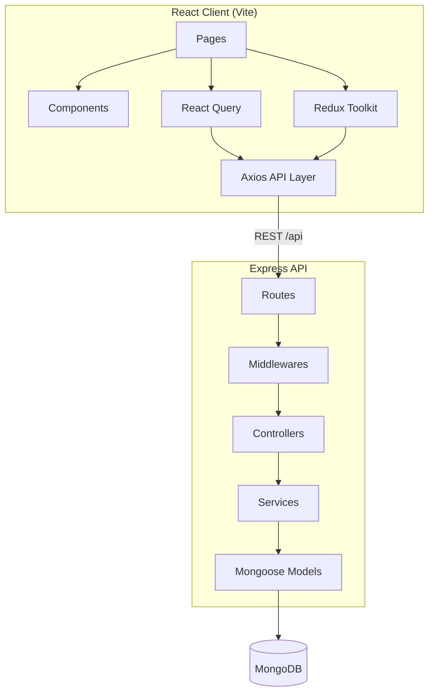

# CompanyTracker

**Master Company-Wise Coding Interview Questions**

[](https://nodejs.org/)
[](https://react.dev/)
[](https://www.mongodb.com/)
[](https://expressjs.com/)
[](LICENSE)

CompanyTracker is a production-ready SaaS interview preparation platform. Users browse company-wise LeetCode questions, track solved progress, maintain revision lists, save private notes, monitor daily streaks, and measure interview readiness through analytics.

Think of it as an **Interview Preparation Operating System** — not a simple CRUD app.

---

## Table of Contents

- [Overview](#overview)
- [Features](#features)
- [Tech Stack](#tech-stack)
- [Architecture](#architecture)
- [Project Structure](#project-structure)
- [Getting Started](#getting-started)
- [Environment Variables](#environment-variables)
- [Demo Accounts](#demo-accounts)
- [Available Scripts](#available-scripts)
- [Database Design](#database-design)
- [Authentication & Authorization](#authentication--authorization)
- [API Reference](#api-reference)
- [Frontend Routes](#frontend-routes)
- [CSV Import System](#csv-import-system)
- [Progress Tracking & Streaks](#progress-tracking--streaks)
- [Theme & Design System](#theme--design-system)
- [Security](#security)
- [Deployment](#deployment)
- [Troubleshooting](#troubleshooting)
- [Roadmap](#roadmap)
- [License](#license)

---

## Overview

### Vision

CompanyTracker helps engineers prepare for coding interviews **company by company**. Instead of solving random LeetCode problems, users follow curated question lists from top tech companies (Amazon, Google, Microsoft, Meta, and more) while tracking personal progress over time.

### Who Is It For?

| Audience | Use Case |
|----------|----------|
| **Candidates** | Track solved questions, bookmarks, revisions, notes, and streaks |
| **Admins** | Manage companies, upload questions via CSV, view platform analytics |
| **Teams / Bootcamps** | Centralized interview prep with leaderboard and progress export |

### Core Capabilities

- Company-wise question browsing with search, sort, and filters
- Per-user progress tracking (solved, bookmarked, revision, notes)
- Analytics dashboard with charts and interview readiness score
- Daily streak system with best streak tracking
- Global search across questions, companies, and tags
- Admin panel with CSV bulk import
- Mobile-responsive UI with bottom navigation

---

## Features

### Public (No Login Required)

| Feature | Description |
|---------|-------------|
| **Landing Page** | Hero, features, live stats, dashboard preview, companies, testimonials, FAQ |
| **Browse Companies** | View all companies with logos, question counts, and progress (when logged in) |
| **Company Questions** | Paginated question grid with difficulty and status filters |
| **Question Details** | View question metadata and LeetCode link |
| **Leaderboard** | Weekly, monthly, and all-time top performers |

### User Features (Authenticated)

| Feature | Description |
|---------|-------------|
| **Dashboard** | Total/solved/remaining questions, bookmarks, revisions, streak, readiness score |
| **Analytics Charts** | Solved by difficulty, weekly progress, monthly progress, company-wise progress |
| **Progress Actions** | Mark solved, bookmark, add to revision on any question |
| **Private Notes** | Rich text notes per question with auto-save |
| **Bookmarks Page** | Dedicated list of saved questions |
| **Revision Page** | Questions marked for revision before interviews |
| **Study Calendar** | Monthly heatmap of solved questions |
| **Profile** | Edit name/avatar, export progress as JSON, share profile link |
| **Global Search** | Debounced search across titles, tags, companies, difficulty |
| **Motivational Insights** | Contextual tips based on streak and completion |

### Admin Features

| Feature | Description |
|---------|-------------|
| **Admin Dashboard** | Total users, questions, companies, DAU, charts |
| **Company CRUD** | Create, edit, delete companies with logo URLs |
| **Question CRUD** | Add, edit, delete individual questions |
| **CSV Import** | Bulk upload questions with validation and duplicate prevention |
| **Platform Analytics** | Most solved company, most bookmarked question, active users |

### Premium UI/UX

- Dark mode by default with glassmorphism accents
- Framer Motion animations on landing page
- Skeleton loaders, empty states, toast notifications
- Lazy-loaded routes and code splitting
- Sticky table headers, responsive data grids
- Mobile bottom navigation (Home, Companies, Progress, Bookmarks, Profile)

---

## Tech Stack

### Frontend (`client/`)

| Category | Technology |
|----------|------------|
| Framework | React 18 |
| Build Tool | Vite 5 |
| Routing | React Router DOM 6 |
| State (Client) | Redux Toolkit |
| State (Server) | TanStack React Query 5 |
| HTTP Client | Axios |
| Styling | Tailwind CSS 4 |
| UI Primitives | Radix UI |
| Icons | Lucide React |
| Charts | Recharts |
| Animations | Framer Motion |
| Notifications | React Hot Toast |

### Backend (`server/`)

| Category | Technology |
|----------|------------|
| Runtime | Node.js 18+ |
| Framework | Express.js 4 |
| Database | MongoDB (Atlas or local) |
| ODM | Mongoose 8 |
| Authentication | JWT + bcryptjs |
| Validation | Joi |
| File Upload | Multer |
| CSV Parsing | csv-parser |
| Security | Helmet, CORS, express-rate-limit |

---

## Architecture

CompanyTracker follows a **clean layered architecture** on the backend and a **feature-based structure** on the frontend.



### Backend Layers

```
Request → Route → Middleware (auth, validation, upload) → Controller → Service → Model → MongoDB
```

| Layer | Responsibility |
|-------|----------------|
| **Routes** | Define HTTP endpoints and attach middleware |
| **Controllers** | Handle request/response, call services |
| **Services** | Business logic, aggregations, streak calculations |
| **Models** | Mongoose schemas, indexes, hooks |
| **Middlewares** | JWT auth, RBAC, error handling, file upload |
| **Validators** | Joi schemas for request body validation |

### Frontend Layers

```
Page → Components → React Query / Redux → API Module → Axios → Backend
```

| Layer | Responsibility |
|-------|----------------|
| **Pages** | Route-level views |
| **Components** | Reusable UI (layout, auth guards, shadcn-style primitives) |
| **Store** | Auth state persisted in localStorage |
| **API** | Typed endpoint functions grouped by domain |
| **Lib** | Utilities (cn, debounce, difficulty colors) |

---

## Project Structure

```
companyTracker/
├── client/                          # React frontend
│   ├── public/
│   │   └── favicon.svg
│   ├── src/
│   │   ├── api/
│   │   │   ├── axios.js             # Axios instance + interceptors
│   │   │   └── index.js             # API endpoint functions
│   │   ├── components/
│   │   │   ├── auth/
│   │   │   │   └── ProtectedRoute.jsx
│   │   │   ├── layout/
│   │   │   │   └── AppLayout.jsx    # Sidebar, top bar, mobile nav
│   │   │   └── ui/                  # Button, Card, Input, Badge, etc.
│   │   ├── lib/
│   │   │   └── utils.js
│   │   ├── pages/
│   │   │   ├── auth/                # Login, Register, Forgot/Reset password
│   │   │   ├── LandingPage.jsx
│   │   │   ├── DashboardPage.jsx
│   │   │   ├── CompaniesPage.jsx
│   │   │   ├── CompanyDetailPage.jsx
│   │   │   ├── QuestionDetailPage.jsx
│   │   │   ├── BookmarksPage.jsx
│   │   │   ├── RevisionPage.jsx
│   │   │   ├── LeaderboardPage.jsx
│   │   │   ├── ProfilePage.jsx
│   │   │   ├── AdminPage.jsx
│   │   │   └── SearchPage.jsx
│   │   ├── store/
│   │   │   ├── authSlice.js
│   │   │   └── index.js
│   │   ├── App.jsx                  # Routes + lazy loading
│   │   ├── main.jsx
│   │   └── index.css                # Tailwind + theme tokens
│   ├── .env.example
│   ├── index.html
│   ├── jsconfig.json
│   ├── package.json
│   └── vite.config.js
│
├── server/                          # Express backend
│   ├── src/
│   │   ├── config/
│   │   │   ├── db.js                # MongoDB connection
│   │   │   └── constants.js         # Roles, difficulties, statuses
│   │   ├── controllers/             # Route handlers
│   │   ├── middlewares/
│   │   │   ├── auth.js              # protect, authorize
│   │   │   ├── optionalAuth.js      # Guest + logged-in support
│   │   │   ├── errorHandler.js
│   │   │   └── upload.js            # Multer CSV/image upload
│   │   ├── models/
│   │   │   ├── User.js
│   │   │   ├── Company.js
│   │   │   ├── Question.js
│   │   │   ├── UserProgress.js
│   │   │   ├── Note.js
│   │   │   └── RevisionList.js
│   │   ├── routes/                  # API route definitions
│   │   ├── services/                # Business logic
│   │   ├── seed/
│   │   │   └── seed.js              # Database seeder
│   │   ├── utils/
│   │   │   ├── ApiError.js
│   │   │   ├── asyncHandler.js
│   │   │   ├── generateToken.js
│   │   │   └── helpers.js
│   │   ├── validators/
│   │   │   └── schemas.js           # Joi validation schemas
│   │   └── index.js                 # Express app entry
│   ├── sample-data/
│   │   └── amazon.csv               # Sample CSV for import
│   ├── .env.example
│   └── package.json
│
├── package.json                     # Root scripts (dev, seed, build)
├── .gitignore
└── README.md
```

---

## Getting Started

### Prerequisites

- **Node.js** 18 or higher
- **npm** 9+ (or yarn/pnpm)
- **MongoDB** — local instance or [MongoDB Atlas](https://www.mongodb.com/atlas) cluster

### Quick Start (Recommended)

```bash
# 1. Clone the repository
git clone <your-repo-url>
cd companyTracker

# 2. Install all dependencies (root + server + client)
npm install
npm run install:all

# 3. Configure environment
cp server/.env.example server/.env
cp client/.env.example client/.env

# 4. Seed the database
npm run seed

# 5. Start both servers
npm run dev
```

| Service | URL |
|---------|-----|
| Frontend | http://localhost:5173 |
| Backend API | http://localhost:5000/api |
| Health Check | http://localhost:5000/api/health |

### Manual Setup

```bash
# Backend
cd server
cp .env.example .env
npm install
npm run seed
npm run dev

# Frontend (new terminal)
cd client
cp .env.example .env
npm install
npm run dev
```

### Production Build

```bash
# Build frontend
cd client
npm run build
# Output: client/dist/

# Start backend (serves API only; deploy frontend separately or via CDN)
cd server
npm start
```

---

## Environment Variables

### Server (`server/.env`)

| Variable | Required | Default | Description |
|----------|----------|---------|-------------|
| `PORT` | No | `5000` | Express server port |
| `NODE_ENV` | No | `development` | Environment mode |
| `MONGODB_URI` | **Yes** | — | MongoDB connection string |
| `JWT_SECRET` | **Yes** | — | Secret for signing JWT tokens |
| `JWT_EXPIRE` | No | `7d` | Token expiration (e.g. `7d`, `24h`) |
| `CLIENT_URL` | No | `http://localhost:5173` | Allowed CORS origin |
| `SMTP_HOST` | No | — | SMTP host for password reset emails |
| `SMTP_PORT` | No | `587` | SMTP port |
| `SMTP_USER` | No | — | SMTP username |
| `SMTP_PASS` | No | — | SMTP password / app password |
| `EMAIL_FROM` | No | — | Sender email address |

**Example `server/.env`:**

```env
PORT=5000
NODE_ENV=development
MONGODB_URI=mongodb://localhost:27017/companytracker
JWT_SECRET=your-super-secret-jwt-key-change-in-production
JWT_EXPIRE=7d
CLIENT_URL=http://localhost:5173
```

**MongoDB Atlas example:**

```env
MONGODB_URI=mongodb+srv://<user>:<password>@cluster.mongodb.net/companytracker?retryWrites=true&w=majority
```

### Client (`client/.env`)

| Variable | Required | Default | Description |
|----------|----------|---------|-------------|
| `VITE_API_URL` | No | `/api` | API base URL (use `/api` with Vite proxy in dev) |

**Example `client/.env`:**

```env
VITE_API_URL=/api
```

> In development, Vite proxies `/api` to `http://localhost:5000` (see `client/vite.config.js`). In production, set `VITE_API_URL` to your deployed API URL.

---

## Demo Accounts

After running `npm run seed`:

| Role | Email | Password |
|------|-------|----------|
| **Admin** | admin@companytracker.com | admin123 |
| **User** | demo@companytracker.com | demo123 |

### Seeded Data

- **8 companies**: Amazon, Google, Microsoft, Adobe, Meta, Netflix, Uber, Atlassian
- **15 questions per company** (120 total)
- Sample tags, acceptance rates, and frequency rates
- Curated list tags (`blind_75`, `neetcode_150`) on select questions

---

## Available Scripts

### Root (`companyTracker/`)

| Script | Description |
|--------|-------------|
| `npm run install:all` | Install server + client dependencies |
| `npm run dev` | Start backend and frontend concurrently |
| `npm run dev:server` | Start backend only |
| `npm run dev:client` | Start frontend only |
| `npm run seed` | Seed MongoDB with demo data |
| `npm run build` | Build frontend for production |

### Server (`server/`)

| Script | Description |
|--------|-------------|
| `npm run dev` | Start with nodemon (hot reload) |
| `npm start` | Start production server |
| `npm run seed` | Run database seeder |

### Client (`client/`)

| Script | Description |
|--------|-------------|
| `npm run dev` | Start Vite dev server |
| `npm run build` | Production build to `dist/` |
| `npm run preview` | Preview production build locally |

---

## Database Design

### Collections Overview

| Collection | Purpose |
|------------|---------|
| `users` | Authentication, profile, streaks |
| `companies` | Company metadata and question counts |
| `questions` | LeetCode questions linked to companies |
| `userprogresses` | Per-user solved/bookmark/revision state |
| `notes` | Private notes per user per question |
| `revisionlists` | User revision list collections |

### Schema Details

#### Users

```js
{
  name: String,
  email: String (unique),
  password: String (hashed, select: false),
  avatar: String,
  role: 'user' | 'admin',
  currentStreak: Number,
  bestStreak: Number,
  lastSolvedDate: Date,
  solvedDates: [Date],
  isPublicProfile: Boolean,
  resetPasswordToken: String,
  resetPasswordExpire: Date
}
```

**Indexes:** `email`, `currentStreak`, `role`

#### Companies

```js
{
  name: String (unique),
  slug: String (unique),
  logo: String,
  description: String,
  website: String,
  totalQuestions: Number,
  isActive: Boolean,
  tags: [String]
}
```

**Indexes:** `name` (text), `slug`, `isActive`

#### Questions

```js
{
  questionNumber: Number,
  title: String,
  slug: String,
  url: String,
  difficulty: 'Easy' | 'Medium' | 'Hard',
  acceptanceRate: Number (0-100),
  frequencyRate: Number (0-100),
  company: ObjectId → Company,
  tags: [String],
  curatedLists: ['blind_75', 'neetcode_150'],
  leetcodeId: String,
  isActive: Boolean
}
```

**Indexes:** `{ company, questionNumber }` (unique), `{ company, slug }` (unique), `title` (text), `difficulty`, `curatedLists`

#### UserProgress

```js
{
  user: ObjectId → User,
  question: ObjectId → Question,
  company: ObjectId → Company,
  status: 'not_started' | 'solved' | 'revision',
  isBookmarked: Boolean,
  isRevision: Boolean,
  solvedAt: Date,
  hasNotes: Boolean
}
```

**Indexes:** `{ user, question }` (unique), `{ user, status }`, `{ user, isBookmarked }`, `{ user, isRevision }`, `{ user, company }`, `{ user, solvedAt }`

#### Notes

```js
{
  user: ObjectId → User,
  question: ObjectId → Question,
  content: String
}
```

**Indexes:** `{ user, question }` (unique), `{ user, updatedAt }`

---

## Authentication & Authorization

### Authentication Flow

1. User registers or logs in → server returns JWT + user object
2. Client stores token in `localStorage`
3. Axios interceptor attaches `Authorization: Bearer <token>` to every request
4. On `401` response, token is cleared and user is redirected to `/login`

### Password Reset Flow

1. User submits email on `/forgot-password`
2. Server generates reset token (valid 1 hour)
3. In development, reset URL is returned in API response
4. User visits `/reset-password?token=...` and sets new password

### Roles

| Role | Permissions |
|------|-------------|
| **user** | Dashboard, progress, notes, bookmarks, revision, profile, search |
| **admin** | All user permissions + company CRUD, question CRUD, CSV import, admin dashboard |

### Route Protection

| Middleware | Usage |
|------------|-------|
| `protect` | Requires valid JWT |
| `authorize('admin')` | Requires admin role |
| `optionalAuth` | Attaches user if token present; allows guests |

---

## API Reference

**Base URL:** `http://localhost:5000/api`

**Response format:**

```json
{
  "success": true,
  "data": { ... },
  "message": "Optional message",
  "errors": null
}
```

**Auth header (protected routes):**

```
Authorization: Bearer <jwt_token>
```

---

### Health

| Method | Endpoint | Auth | Description |
|--------|----------|------|-------------|
| GET | `/health` | No | API health check |

---

### Auth (`/api/auth`)

| Method | Endpoint | Auth | Description |
|--------|----------|------|-------------|
| POST | `/register` | No | Register new user |
| POST | `/login` | No | Login and receive JWT |
| POST | `/logout` | Yes | Logout (client-side token clear) |
| GET | `/me` | Yes | Get current user profile |
| PUT | `/me` | Yes | Update name, avatar, public profile |
| POST | `/forgot-password` | No | Request password reset |
| POST | `/reset-password` | No | Reset password with token |
| GET | `/profile/:id` | No | Get public user profile |

**Register body:**

```json
{
  "name": "John Doe",
  "email": "john@example.com",
  "password": "secret123"
}
```

**Login body:**

```json
{
  "email": "john@example.com",
  "password": "secret123"
}
```

---

### Companies (`/api/companies`)

| Method | Endpoint | Auth | Description |
|--------|----------|------|-------------|
| GET | `/` | Optional | List companies (search, sort, pagination) |
| GET | `/:slug` | Optional | Get company by slug |
| POST | `/` | Admin | Create company |
| PUT | `/:id` | Admin | Update company |
| DELETE | `/:id` | Admin | Delete company and its questions |

**Query params (GET `/`):**

| Param | Values | Description |
|-------|--------|-------------|
| `search` | string | Filter by name/slug |
| `sort` | `name`, `questions`, `newest` | Sort order |
| `page` | number | Page number (default: 1) |
| `limit` | number | Items per page (default: 20) |

---

### Questions (`/api/questions`)

| Method | Endpoint | Auth | Description |
|--------|----------|------|-------------|
| GET | `/search` | Optional | Global search |
| GET | `/company/:slug` | Optional | Questions for a company |
| GET | `/` | Optional | List questions (with filters) |
| GET | `/:id` | Optional | Get question by ID |
| POST | `/` | Admin | Create question |
| PUT | `/:id` | Admin | Update question |
| DELETE | `/:id` | Admin | Delete question |

**Query params (list/search):**

| Param | Values | Description |
|-------|--------|-------------|
| `search` | string | Search title/tags |
| `difficulty` | `Easy`, `Medium`, `Hard` | Filter by difficulty |
| `status` | `solved`, `unsolved`, `revision`, `bookmarked` | Filter by user progress |
| `sort` | `questionNumber`, `title`, `difficulty`, `acceptance`, `frequency` | Sort field |
| `curatedList` | `blind_75`, `neetcode_150` | Filter curated lists |
| `page`, `limit` | numbers | Pagination |

---

### Progress (`/api/progress`) — Auth Required

| Method | Endpoint | Description |
|--------|----------|-------------|
| GET | `/dashboard` | User dashboard stats and charts |
| GET | `/bookmarks` | Bookmarked questions |
| GET | `/revisions` | Revision list questions |
| GET | `/calendar` | Study calendar (`?year=2026&month=6`) |
| GET | `/export` | Export all progress as JSON |
| PUT | `/:questionId` | Update progress for a question |

**Update progress body:**

```json
{
  "status": "solved",
  "isBookmarked": true,
  "isRevision": false
}
```

---

### Notes (`/api/notes`) — Auth Required

| Method | Endpoint | Description |
|--------|----------|-------------|
| GET | `/` | List all user notes |
| GET | `/:questionId` | Get note for a question |
| PUT | `/:questionId` | Create or update note (auto-save) |
| DELETE | `/:questionId` | Delete note |

**Upsert body:**

```json
{
  "content": "Use hash map for O(n) solution. Watch edge cases."
}
```

---

### Admin (`/api/admin`)

| Method | Endpoint | Auth | Description |
|--------|----------|------|-------------|
| GET | `/stats` | No | Public platform statistics |
| GET | `/leaderboard` | No | Leaderboard (`?period=weekly\|monthly\|alltime`) |
| GET | `/dashboard` | Admin | Admin analytics dashboard |
| POST | `/import-csv` | Admin | Upload CSV file (`multipart/form-data`) |

**CSV upload form fields:**

| Field | Type | Description |
|-------|------|-------------|
| `file` | File | CSV file (required) |
| `companyId` | string | Target company ID (optional; auto-detect from filename if omitted) |

---

## Frontend Routes

| Route | Access | Page |
|-------|--------|------|
| `/` | Public | Landing page |
| `/login` | Public (redirects if logged in) | Login |
| `/register` | Public (redirects if logged in) | Register |
| `/forgot-password` | Public | Forgot password |
| `/reset-password` | Public | Reset password |
| `/companies` | Public | Company list |
| `/companies/:slug` | Public | Company question grid |
| `/questions/:id` | Public | Question detail + notes |
| `/leaderboard` | Public | Leaderboard |
| `/dashboard` | Protected | User dashboard |
| `/bookmarks` | Protected | Bookmarks |
| `/revision` | Protected | Revision list |
| `/profile` | Protected | User profile |
| `/search` | Protected | Global search |
| `/admin` | Admin only | Admin panel |

### Mobile Bottom Navigation

| Tab | Route |
|-----|-------|
| Home | `/dashboard` |
| Companies | `/companies` |
| Progress | `/dashboard` |
| Bookmarks | `/bookmarks` |
| Profile | `/profile` |

---

## CSV Import System

Admins can bulk-import questions via the Admin Dashboard or API.

### CSV Format

```csv
ID,URL,Title,Difficulty,Acceptance %,Frequency %
1,https://leetcode.com/problems/two-sum/,Two Sum,Easy,57.50%,100.00%
2,https://leetcode.com/problems/add-two-numbers/,Add Two Numbers,Medium,46.20%,85.00%
```

### Column Mapping

| CSV Column | Field | Required |
|------------|-------|----------|
| `ID` | questionNumber | Yes |
| `URL` | url | Yes |
| `Title` | title | Yes |
| `Difficulty` | difficulty (`Easy`, `Medium`, `Hard`) | Yes |
| `Acceptance %` | acceptanceRate | No |
| `Frequency %` | frequencyRate | No |

### Import Modes

1. **Select company + upload** — Pass `companyId` in form data
2. **Auto-detect from filename** — e.g. `amazon.csv` → creates/finds "Amazon" company

### Import Behavior

- Validates required fields and difficulty values
- Skips duplicates (by URL, slug, or question number within company)
- Updates company `totalQuestions` count after import
- Returns summary: total, imported, skipped, errors

**Sample file:** `server/sample-data/amazon.csv`

---

## Progress Tracking & Streaks

### Progress States

| Status | Description |
|--------|-------------|
| `not_started` | Default — user hasn't interacted |
| `solved` | User marked question as solved |
| `revision` | Question flagged for revision |

### Independent Flags

- `isBookmarked` — saved for later
- `isRevision` — needs revisiting before interview
- `hasNotes` — user has written notes
- `solvedAt` — timestamp when marked solved

### Daily Streak Rules

- Solve **at least one new question per day** to maintain streak
- Missing a day resets `currentStreak` to 1 on next solve
- `bestStreak` stores the all-time highest streak

### Interview Readiness Score

Calculated from:

- Completion percentage (up to 60 points)
- Current streak (up to 20 points)
- Revision backlog penalty
- Base score offset

Displayed on the user dashboard (0–100%).

---

## Theme & Design System

### Color Palette

| Token | Hex | Usage |
|-------|-----|-------|
| Background | `#0F172A` | Page background |
| Card | `#1E293B` | Cards, panels |
| Primary | `#6366F1` | Buttons, accents |
| Success | `#22C55E` | Solved, easy |
| Warning | `#F59E0B` | Medium, revision |
| Danger | `#EF4444` | Hard, errors |
| Foreground | `#F8FAFC` | Primary text |
| Muted | `#94A3B8` | Secondary text |
| Border | `#334155` | Borders, dividers |

### Typography

- **Font:** Inter (Google Fonts)
- **Mode:** Dark by default

### UI Patterns

- Glassmorphism cards (`.glass`)
- Gradient headlines (`.gradient-text`)
- Skeleton loaders for async content
- Toast notifications for actions
- Responsive grid layouts with sticky table headers

---

## Security

| Measure | Implementation |
|---------|----------------|
| Password hashing | bcrypt (12 rounds) |
| Authentication | JWT with configurable expiry |
| HTTP headers | Helmet |
| CORS | Restricted to `CLIENT_URL` |
| Rate limiting | 200 requests / 15 min per IP on `/api` |
| Input validation | Joi schemas on all write endpoints |
| RBAC | Admin-only routes via `authorize` middleware |
| File upload | CSV only, 10MB limit; images 2MB for logos |

### Production Checklist

- [ ] Set strong `JWT_SECRET`
- [ ] Use MongoDB Atlas with IP whitelist
- [ ] Enable HTTPS
- [ ] Configure real SMTP for password reset
- [ ] Set `NODE_ENV=production`
- [ ] Never commit `.env` files

---

## Deployment

### Backend (e.g. Railway, Render, Fly.io)

```bash
cd server
npm install
npm start
```

Set environment variables in your hosting dashboard.

### Frontend (e.g. Vercel, Netlify)

```bash
cd client
npm install
npm run build
```

Deploy `client/dist/` and set:

```env
VITE_API_URL=https://your-api-domain.com/api
```

### Docker (Optional)

You can containerize each service separately. Ensure `MONGODB_URI` points to your database and `CLIENT_URL` matches your frontend domain.

---

## Troubleshooting

### MongoDB connection failed

```
Error: connect ECONNREFUSED 127.0.0.1:27017
```

- Ensure MongoDB is running locally, or
- Update `MONGODB_URI` to your Atlas connection string

### CORS errors in browser

- Verify `CLIENT_URL` in `server/.env` matches your frontend URL exactly
- Include protocol (`http://` or `https://`)

### 401 on protected routes

- Check token exists in `localStorage`
- Token may be expired — log in again
- Ensure `Authorization: Bearer <token>` header is sent

### CSV import errors

- Verify column headers match expected format
- Difficulty must be `Easy`, `Medium`, or `Hard`
- Check for duplicate URLs or question numbers

### Frontend build fails

```bash
cd client
rm -rf node_modules dist
npm install
npm run build
```

### Port already in use

```bash
# Change PORT in server/.env
PORT=5001

# Or change Vite port in client/vite.config.js
```

---

## Roadmap

Planned and partially scaffolded features for future releases:

- [ ] Blind 75 / NeetCode 150 dedicated trackers
- [ ] PDF progress report export
- [ ] Public shareable progress cards
- [ ] Email notifications for password reset (SMTP)
- [ ] Revision reminders
- [ ] OAuth (Google / GitHub)
- [ ] Question discussion threads
- [ ] Spaced repetition scheduling

---

## License

MIT License — see [LICENSE](LICENSE) for details.

---

## Acknowledgments

Built with inspiration from the design quality of Linear, Notion, Vercel, GitHub, and LeetCode.

---

<p align="center">
  <strong>CompanyTracker</strong> — Crack Coding Interviews Company by Company
</p>
